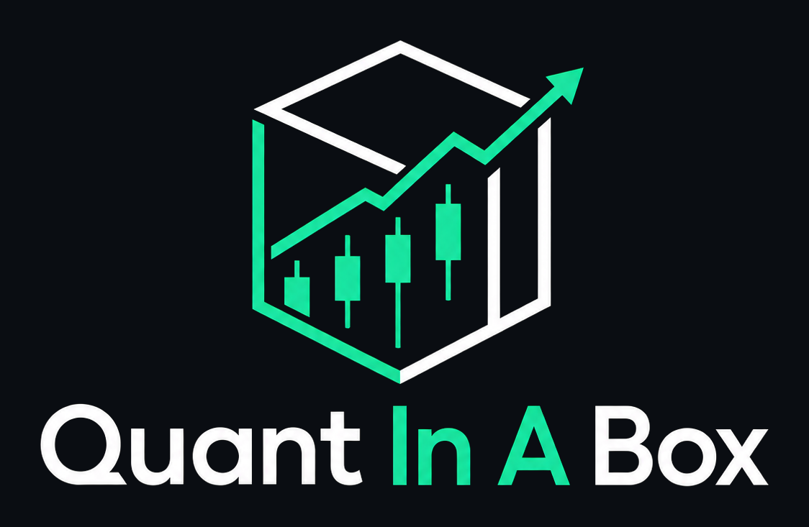
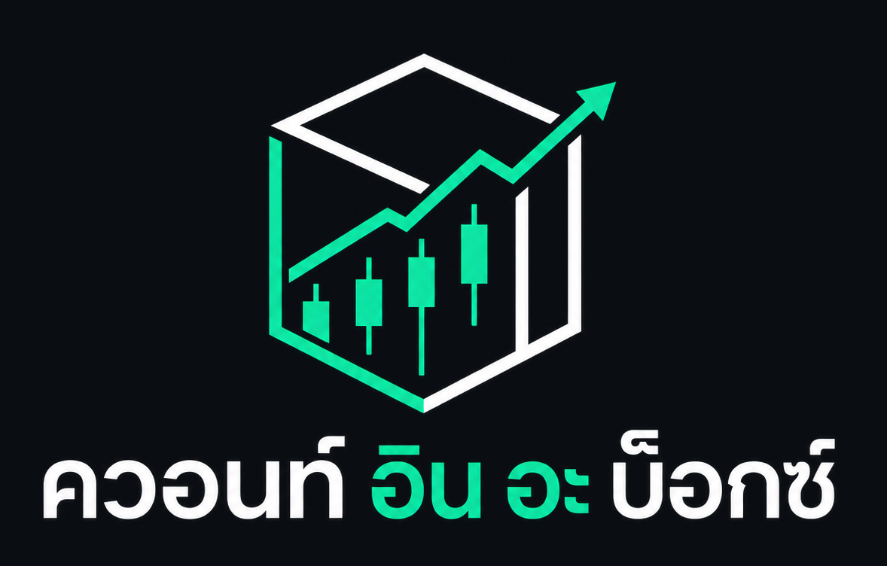

<div align="center">

<table>
<tr>
<td align="center" width="50%"></td>
<td align="center" width="50%"></td>
</tr>
</table>

### Institutional-grade quant analytics for retail traders and students.

_Thai (ไทย) is the first non-English language with the Academy's quiz content fully translated too, not just the interface — see [Internationalization](#internationalization)._

[](https://github.com/WillBe89/quant-in-a-box/releases/latest)
[](https://github.com/WillBe89/quant-in-a-box/releases/latest)
[](https://github.com/WillBe89/quant-in-a-box/releases/latest)

 

</div>

---

Quant In A Box is a desktop application that brings institutional-grade quantitative analytics to retail traders and students: technical indicators, forward-looking forecast overlays, options Greeks, portfolio risk grading, a graded financial-literacy Academy, and AI-assisted commentary, wrapped in a fast, native Electron + React interface. It runs entirely on realistic, deterministically generated mock market data out of the box, so it's fully usable with zero configuration and zero API keys, while also supporting your own optional API keys for real quotes, real historical price data, and real AI insights.

## Why This Exists

I built this for my girlfriend. She wants to invest, in stocks, crypto, and everything in between, but the tools built for that are made for people who already speak the language: charts full of jargon, ratios with no explanation, and dashboards that assume you already know what a Sharpe ratio is. Quant In A Box is my attempt to close that gap. Every chart, indicator, and risk metric comes with a plain-English lesson attached, so the "Teaching Zone" isn't a bolted-on help page, it's the whole point.

It's designed first as a learning tool, but it isn't a toy. Once you're comfortable, you can build out real portfolios, entering your actual holdings across stocks, crypto, bonds, FX, and real estate, and get the same statistical analysis (Sharpe, Sortino, volatility, Value at Risk, drawdown, beta, options Greeks) that professional analysts use to reason about risk. The one thing it deliberately does not do is place trades. There's no brokerage connection and no buy/sell button; it's an analysis and education tool, not an execution platform.

**Nothing in this app is financial advice.** The AI commentary, the risk indicators, the lesson content, none of it is a recommendation to buy, sell, or hold anything. Every number here is a description of the past, not a promise about the future, and every decision you make while using it is entirely your own responsibility. If you're ever unsure, talk to a licensed financial advisor, not an app.

I hope it helps someone, even in some small way, understand what they're looking at a little better. And if it ever helps you make some money: consider [buying me a coffee](#support). :)

## Screenshots

> _Screenshots below are placeholders pending a live capture pass from the actual running app — see [`docs/screenshots/`](docs/screenshots/). Each will be replaced with a real image taken directly from the app, not stock/placeholder art._

| | |
|---|---|
| **Candlestick workspace with indicators** _(placeholder)_ | **Forward-forecasting overlay** _(placeholder)_ |
| **Glass/fluid visual theme** _(placeholder)_ | **Portfolio risk grade & advice** _(placeholder)_ |
| **Options pricing & Greeks** _(placeholder)_ | **Market news with images & categories** _(placeholder)_ |
| **Academy home & pre-quiz study screen** _(placeholder)_ | **A quiz in progress, with an earned badge** _(placeholder)_ |
| **Asset browser table** _(placeholder)_ | **Portfolio holdings-chart dashboard** _(placeholder)_ |
| **A non-English (RTL) locale** _(placeholder)_ | |

## Features

### Charting & Analytics
- Interactive candlestick charts (plus bar, line, area, and baseline styles) with a rich hover crosshair showing date, volume, change vs. the prior bar, and live indicator values.
- Built-in technical indicators: moving averages (SMA/EMA), Bollinger Bands, RSI, MACD, and an optional volume histogram, all individually toggleable and overlaid directly on the chart.
- **Forward-looking forecast overlay**, selectable between three distinct statistical methods (drift/GBM, linear regression, and a 500-path Monte Carlo simulation), each rendered as a dashed projection band clearly distinguished from real historical data, with a collapsible/dismissible "not a prediction" disclaimer.
- Multiple chart layout templates (single, 2-up, focus+1, 3-up, and a mixed 1+2 grid), each independently resizable.
- A "glass" visual theme with three independently toggleable tiers (panels, chrome, and the chart canvas itself), plus a soft animated gradient background, on top of full light/dark theme support.
- An asset insight popover on every chart, showing real company-profile data for stocks (industry, market cap, shares outstanding, IPO year, exchange) or a real composition/holdings breakdown for curated ETFs (Vanguard, iShares/BlackRock, and other major issuers).
- Options pricing and Greeks calculated with the Black-Scholes model.
- At-a-glance risk indicators (Sharpe, Sortino, Volatility, VaR, Max Drawdown, Beta) shown with color-coded good/neutral/bad faces based on documented thresholds.
- A searchable, sortable, paginated asset browser table across the entire ~13,000-asset universe (stocks, ETFs, cryptocurrencies, bonds, FX, and real estate), with class filters and ranked search (exact/prefix/substring matching) so popular tickers surface first.
- Customizable ticker tape that can track your watchlist, your portfolio, or the full market.
- Market News panel with article images, category chips (general/forex/crypto/merger), and filtering to whatever you're viewing, your watchlist, or your portfolio.
- A local SQLite database that persists every candle and news article this app has ever fetched, plus one-click Excel export of your portfolio reports or the entire local market-data archive.

### Portfolio Tracking
- Track your holdings by symbol, quantity, and cost basis, with new buys automatically blended into a weighted average cost.
- See per-position market value, unrealized P&L ($/%), and portfolio weight, plus portfolio-wide totals.
- Real portfolio-level analytics (Sharpe, Sortino, Volatility, VaR, Max Drawdown, Beta) computed from your actual blended holdings, not just a single symbol, plus a 0-100 risk grade and plain-English advice (deliberately excluding Sharpe/Sortino from the grade itself, framed as description rather than verdict).
- A dedicated holdings-charts dashboard tab: a real mini price chart per position, so you can see how each holding has actually moved without leaving the portfolio view.
- Create, name, rename, and delete multiple named portfolios, directly from the portfolio page itself.
- Compare any portfolio against model benchmarks, and view an aggregate cross-portfolio overview.
- Open and view several portfolios side by side at once, each with its own independent positions and analytics.
- Maintain a personal watchlist, with quick add/remove/reset and one-click star-toggle access from any chart.

### The Academy
- A "Teaching Zone" with a full financial-literacy library: lessons covering indicators, options Greeks, risk statistics, and dedicated primers on each asset class (stocks/ETFs, crypto, bonds, FX & commodities, real estate/REITs).
- A separate, graded "Academy" mode: sampled quizzes per subject module plus a cumulative Final Exam, five earned badges, and a downloadable PDF certificate per badge with your own name on it.
- A real "study before you begin" screen shown before every quiz, with the full lesson content, real illustrative charts for trend indicators, and a hand-drawn options payoff diagram — reachable again *during* an active quiz too, without losing your progress or answers.
- A collapsible/dismissible anti-cheating disclaimer on the quiz itself, backed by a smaller persistent reminder on every question that never goes away, even if you've dismissed the bigger one.
- 261 real quiz questions across all 17 lessons, independently audited for factual accuracy against the library's own content.

### Data: Bring Your Own Key, Real or Mock
- Works completely out of the box with **zero API keys and zero configuration**, running entirely on realistic, internally consistent generated mock data.
- Optionally connect your own free-tier keys for **Finnhub**, **TwelveData**, **CoinGecko**, and **Anthropic** — see [Data & API Keys](#data--api-keys) below for exactly what each one unlocks, honestly, with no overselling.
- Once connected, TwelveData and CoinGecko keys also power background, budget-conscious *proactive* real-history accumulation (not just fetch-on-view), so your watchlist and portfolio symbols build up genuine price history over time.
- A compliant, personal-use import tool for stock-exchange listing files (ASX, HKEX, JPX, SET) that these exchanges' own terms restrict from bulk redistribution — the app never bundles or hosts a copy of that data itself; it only helps you import a file you've personally downloaded from the exchange's own site into your own local database.
- Hand-curated real stock/ETF listings for Oceania and Asia (ASX, NZX, SGX, HKEX, JPX) and major Vanguard/iShares/BlackRock/BetaShares/SPDR ETF ranges, alongside the ~13,000-symbol US stock/ETF/crypto/bond/FX/real-estate universe.

### AI Insights
- Get plain-English AI commentary on your portfolio, powered by your own local Claude Code sign-in (falling back to your own Anthropic API key if you provide one); no separate API key required for most users.
- Every AI insight is shown alongside a permanent, unmissable "not financial advice" disclaimer.
- Insights are labeled with their source (local Claude Code vs. API key) so you always know where the analysis came from.

### Internationalization
- Full interface translation into 10 languages besides English (Chinese, Hindi, Spanish, French, Arabic, Bengali, Portuguese, Russian, Urdu, Thai), selectable from a language switcher.
- The Academy's 261-question quiz bank is additionally fully translated into Thai (with the other 9 non-English locales still queued).
- Correct right-to-left text rendering for Arabic and Urdu.

### Customization & Layout
- Drag-and-drop reordering of dashboard cards (Risk, Options, News), with keyboard-accessible move controls too.
- Show, hide, and reset the visibility of individual dashboard cards.
- Expand any card into a larger pop-out view for a closer look.
- A dedicated Customize panel to manage your watchlist, ticker source, dock layout, portfolios, glass-theme tiers, and API keys in one place.
- Smooth, motion-based UI transitions that automatically respect your OS's reduced-motion setting.
- Custom app branding and icon throughout the app and taskbar.

### Packaging & Distribution
- Installable on Windows (`.exe`), macOS (`.dmg`), and Linux (`.AppImage`) via native installers.
- Automated build and release pipeline: pushes to `main`, PRs against `main`, and manual runs are all checked (typecheck/tests), and tagged releases automatically build and publish installers for all three platforms.

## Data & API Keys

Quant In A Box's real-data model is **bring-your-own-key (BYOK)**: you connect your own free (or paid) accounts with third-party providers directly in the app's Customize panel. Keys are stored locally on your device only — never bundled into the app, never sent anywhere else, and never shared between users.

**A genuine, upfront caveat:** outdated, stale, or low-resolution real data can make the statistical analysis here *less* useful than this app's internally consistent generated defaults, not more. Connecting a key is a real upgrade only when the data behind it is actually current and complete — this app makes no attempt to oversell that trade-off.

| Provider | What it unlocks | Free tier |
|---|---|---|
| [Finnhub](https://finnhub.io/register) | Real quotes, company profiles, and ticker-filtered news. Historical candle data is confirmed **paid-tier-only** on Finnhub's free plan — charts still fall back to generated data even with a free key connected. | Yes |
| [TwelveData](https://twelvedata.com/register) | Real multi-year daily price history for stocks, bonds, FX, and crypto — the main way to get real historical charts in this app. Once connected, a background pass also proactively backfills several years of history for your watchlist/portfolio symbols. | Yes (800 calls/day) |
| [CoinGecko](https://www.coingecko.com/en/api/pricing) | Real crypto price history. Full daily-or-finer resolution within the last 30 days; older history coarsens to a bar every few days on the free tier. Once connected, a background pass also accumulates one real daily candle per relevant crypto asset automatically. | Yes (public tier keyless; a free Demo-tier key raises the rate limit) |
| [Anthropic](https://console.anthropic.com/settings/keys) | Real Claude-powered portfolio insights, replacing the local Claude Code CLI fallback used when no key is connected. | Paid API usage |

A paid-tier key for any of these providers works automatically with **no code changes required** — every adapter always attempts the real request for whatever key is configured and only falls back to mock data on an actual failed response, never on an assumption about your plan tier.

## Tech Stack

- **Electron**: desktop application shell (main/preload/renderer process model)
- **electron-vite**: Vite-based build and dev tooling tailored for Electron
- **Vite**: underlying bundler
- **React 18** + **TypeScript**: renderer UI
- **@vitejs/plugin-react**: JSX / Fast Refresh support in the renderer
- **lightweight-charts**: candlestick/financial charting
- **motion**: UI animation (drag-and-drop reordering, transitions, shared-element modal morphs)
- **i18next** / **react-i18next**: internationalization
- **better-sqlite3**: local, on-device SQLite database for candles/news/profiles/user-imported assets
- **xlsx**: Excel export for portfolio reports and the market-data archive
- **@electron-toolkit/utils** / **@electron-toolkit/preload**: Electron main/preload helper utilities
- **cross-spawn**: safe cross-platform process spawning (used by the AI insights feature to invoke the local Claude Code CLI)
- **vitest**: unit test runner
- **electron-builder**: packaging and installer generation (NSIS/dmg/AppImage) and GitHub Releases publishing

## Getting Started

### Prerequisites

- Node.js (the CI pipeline builds and tests against Node 20)
- npm

### Installation

```bash
git clone https://github.com/WillBe89/quant-in-a-box.git
cd quant-in-a-box
npm install
```

`npm install` will also trigger `postinstall` (`electron-builder install-app-deps`), which rebuilds native Electron app dependencies for your platform.

### Configuration (optional)

```bash
cp .env.example .env
```

The app works out of the box with **zero environment variables**. Without any API keys set, it runs entirely on realistic generated mock data (candles, quotes, option chains, and news), so you can start using it immediately. Every key below can also be entered directly in the app's Customize panel instead of via `.env` — the UI-entered key always takes priority.

| Variable | Required | Purpose |
|---|---|---|
| `VITE_FINNHUB_API_KEY` | No | Free-tier key from [finnhub.io](https://finnhub.io/register); powers live quotes, company profiles, and ticker-filtered news. |
| `VITE_TWELVE_DATA_API_KEY` | No | Free-tier key from [twelvedata.com](https://twelvedata.com/register); real multi-year daily history for stocks, bonds, FX, and crypto, plus proactive background backfill. |
| `VITE_COINGECKO_API_KEY` | No | Free Demo-tier key from [coingecko.com](https://www.coingecko.com/en/api/pricing); real crypto history, plus proactive background daily accumulation. Works keyless too, at a lower rate limit. |
| `ANTHROPIC_API_KEY` | No | Fallback for the "Get AI insights" feature in the Portfolio panel; only used if the local Claude Code CLI isn't installed/signed in. Read only in the Electron main process, never bundled into the renderer. |

`.env` is not committed to git (neither is `.env.example`'s content applicable outside your local copy).

### Run in development

```bash
npm run dev
```

This starts `electron-vite dev`, launching the app with hot reload across the main, preload, and renderer processes.

## Available Scripts

| Script | Command | Description |
|---|---|---|
| `npm run dev` | `electron-vite dev` | Runs the app in development mode with hot reload (main, preload, renderer). |
| `npm run build` | `electron-vite build` | Compiles/bundles main, preload, and renderer for production into `out/`. |
| `npm run typecheck` | `tsc --noEmit -p tsconfig.web.json && tsc --noEmit -p tsconfig.node.json` | Type-checks the renderer project, then the main/preload project, emitting no output. |
| `npm test` | `vitest run` | Runs the test suite once (non-watch mode). |
| `npm run postinstall` | `electron-builder install-app-deps` | Rebuilds/installs native Electron app dependencies after `npm install` (runs automatically). |
| `npm run build:win` | `npm run build && electron-builder --win` | Production build, then packages a Windows NSIS installer. |
| `npm run build:mac` | `npm run build && electron-builder --mac` | Production build, then packages a macOS `.dmg`. |
| `npm run build:linux` | `npm run build && electron-builder --linux` | Production build, then packages a Linux `.AppImage`. |
| `npm run build:unpacked` | `npm run build && electron-builder --dir` | Production build, then outputs an unpacked app directory (no installer) for local testing. |

## Continuous Integration & Releases

A GitHub Actions workflow (`.github/workflows/build.yml`) named **Build** runs on pushes to `main`, pushes of `v*` tags, pull requests targeting `main`, and manual dispatch:

1. **Typecheck & test** (`ubuntu-latest`): runs on every trigger; `npm ci`, `npm run typecheck`, `npm run test`.
2. **Package** (`ubuntu-latest` / `windows-latest` / `macos-latest` matrix): only runs on a `v*` tag push or a manual `workflow_dispatch`, and only after the test job passes.
   - On a tag push, it runs `npx electron-builder --publish always`, publishing installers for all three platforms directly to a draft GitHub Release.
   - On manual dispatch, it runs `npx electron-builder --publish never` and instead uploads the installers as workflow artifacts (no publish).

## Internationalization

The interface is fully translated into the following languages, selectable from the in-app language switcher:

- English (default)
- Chinese
- Hindi
- Spanish
- French
- Arabic
- Bengali
- Portuguese
- Russian
- Urdu
- Thai

Arabic and Urdu render with correct right-to-left text direction. The Academy's 261-question quiz bank is additionally translated into Thai; the other 9 non-English locales' quiz content is queued for a future pass and falls back to English in the meantime.

**Translation status:** all non-English locale content (interface strings and the Thai quiz translation) was produced by an AI translate, parity-check, and fluency-spot-check pipeline, not by native speakers. It's a solid, independently-verified first pass, not final copy. In particular, the financial terminology (Sharpe, Sortino, VaR, Greeks, etc.) used throughout has established, sometimes non-obvious translations in each market that an automated pass can miss. Native-speaker review is pending for all of it.

## Not Affiliated, Not Redistributing

Quant In A Box is an independent, personal project and is **not affiliated with, endorsed by, or sponsored by** any of the companies, exchanges, or data providers it references or optionally connects to, including but not limited to Finnhub, Twelve Data, CoinGecko, Anthropic, NASDAQ, ASX, NZX, SGX, HKEX, JPX, SET, Vanguard, BlackRock/iShares, BetaShares, and State Street/SPDR. All trademarks, logos, and brand names belong to their respective owners.

This app is built for **personal use**, not redistribution. It never bundles, hosts, or ships a copy of any third-party exchange's proprietary listing data — where an exchange's own terms restrict bulk reuse of their listings (ASX, NZX, SGX, HKEX, JPX, SET), it either links directly to that exchange's own official page, or offers a local tool that only ever touches a file you've personally downloaded onto your own machine. Nothing here resells or repackages a data provider's service; you connect your own account, under your own name, on your own terms.

## Known Limitations

The following gaps are known and deliberate. They're documented here rather than hidden, each paired with how it's mitigated today:

1. **Simulated market data by default.** Most of the ~13,000-asset universe renders on generated mock data unless you connect a Finnhub/TwelveData/CoinGecko key — *mitigated:* the BYOK model above, plus proactive background accumulation once a key is connected, so real coverage grows over time rather than requiring a manual pull every time.
2. **Free-tier real data has real gaps.** Finnhub's free tier blocks historical candles entirely (paid-tier-only, across every asset class); TwelveData's free tier caps at 800 calls/day; CoinGecko's free OHLC endpoint only gives true daily resolution within a 30-day window — *mitigated:* this app is honest about each limit in the Customize panel itself (see [Data & API Keys](#data--api-keys)), and layers a local SQLite cache plus proactive daily/backfill accumulation on top so the same data isn't re-fetched needlessly.
3. **Restricted-exchange listings can't be bundled.** ASX/NZX/SGX/HKEX/JPX/SET all restrict bulk redistribution of their own listing files — *mitigated:* direct links to each exchange's own official download page, plus a personal-use local import tool (see [Not Affiliated, Not Redistributing](#not-affiliated-not-redistributing)).
4. **AI translations need native-speaker review.** All non-English locale content, including the newly-translated Thai quiz bank, was produced by an AI pipeline, not native speakers — a solid, independently spot-checked first pass, but not final copy, especially for financial terminology.
5. **RTL layout mirroring is not implemented.** Arabic and Urdu get correct right-to-left text direction, but the dashboard's panel layout (rail/workspace/dock positions, chart orientation) still renders left-to-right. This is a known, deliberate gap.
6. **AI insights: only the local Claude Code path is fully verified end-to-end.** The direct Anthropic-API-key fallback has not been exercised against a live key by the author.
7. **No transaction/lot history.** Portfolios track current positions (symbol, quantity, average cost) only; there's no realized-vs-unrealized P&L splitting or trade history.
8. **No cash/uninvested balance tracking** in the portfolio tracker.
9. **No default-portfolio pinning.** With 2+ saved portfolios, opening the picker shows a manual checklist (most-recently-active one listed first) rather than any user-configurable default or pin.

## Roadmap

Real future upgrades, named honestly rather than oversold as "coming soon." Each of these involves a genuine ongoing cost — data licensing, infrastructure, or regulatory compliance — so each is realistically gated behind either a paid tier or a future monetization decision, not a promised free upgrade:

- **Real trade execution — researched, and deliberately not being pursued right now.** A thorough, adversarially-checked research pass into Australian financial services regulation (ASIC's RG 36) found that even a "bring-your-own-broker-key" order-relay model — no custody of client money, no personalized advice, just relaying an order to a user's own already-licensed brokerage account — is very likely to constitute "arranging," and therefore "dealing," in a financial product, which would require this app to hold its own Australian Financial Services License (AFSL). The one theory that would have made a BYOK relay model clean under existing guidance did not hold up under adversarial review, and for crypto specifically, AUSTRAC's newly-rolled-out virtual asset service provider regime carries criminal penalties for operating unregistered with real ambiguity about whether an order-relay feature is covered. Given that, this app will not add trade execution without first getting real advice from a licensed financial services lawyer — a significant, genuinely uncertain compliance undertaking, not a simple integration.
- **Full bulk historical data**, beyond what BYOK's free tiers currently reach. Every "download it all in bulk" option researched so far has a real legal or cost blocker (see [Data & API Keys](#data--api-keys) for what's already legally clean and shipped); a genuinely comprehensive backfill would likely require a paid data vendor.
- **A portable, independently verifiable Academy credential.** Researched already: LinkedIn's old auto-fill "Add to Profile" certificate link was deprecated industry-wide, so real portability now means standing up a small public credential-verification page (via the open Open Badges standard) outside this desktop app — a genuinely buildable, separate small project.
- **A unified, fully free-form drag-and-drop dashboard**, where any card (chart or otherwise) can be freely resized and repositioned, expanded to fullscreen, and saved across multiple named dashboard layouts. Researched and scoped already: this is a from-scratch layout-engine project, not an extension of anything that exists today, and needs its own dedicated planning pass before being started.

## Project Structure

```
src/
├── main/            Electron main process (Node context)
│   ├── index.ts      Creates the BrowserWindow, wires IPC handlers, loads the renderer
│   ├── aiInsights.ts Portfolio AI-commentary feature (local Claude Code CLI, with Anthropic API fallback)
│   ├── localDb.ts     better-sqlite3-backed local database (candles/news/profiles/user-imported assets)
│   ├── exportData.ts  Excel export (portfolio reports, market-data archive)
│   ├── certificate.ts Academy PDF certificate generation (printToPDF via a hidden BrowserWindow)
│   └── userAssetImport.ts  Per-exchange listing-file import (ASX/HKEX/JPX/SET)
│
├── preload/          Context-bridge boundary
│   ├── index.ts       Exposes window.api / window.electron to the renderer via contextBridge
│   └── index.d.ts      Matching Window type declarations
│
└── renderer/src/      React 18 + Vite UI (Chromium context, no Node access)
    ├── state/          AppStateContext.tsx: single React Context holding app state (symbol/timeframe/
    │                    indicators, watchlist, portfolios with localStorage persistence, theme, language,
    │                    dock layout, glass tiers, open overlays) and its setter actions
    ├── lib/             Pure calculation/utility modules: quant.ts (SMA/EMA, Sharpe, Sortino, VaR, max
    │                    drawdown, Bollinger Bands, RSI, MACD, Black-Scholes/Greeks), forecast.ts (drift/
    │                    regression/Monte Carlo), portfolioMath.ts, riskAssessment.ts, riskGrade.ts
    │                    (each with a co-located .test.ts), plus assetSearch.ts, chartTheme.ts, motion.ts
    ├── data/            Data layer: dataService.ts (routes each asset class to Finnhub/TwelveData/
    │                    CoinGecko live services or mock, per configured key and per-call fallback),
    │                    finnhubAdapter.ts, twelveDataAdapter.ts, coinGeckoAdapter.ts, apiKeyStore.ts,
    │                    dailyQuoteAccumulator.ts / twelveDataBackfill.ts / coinGeckoAccumulator.ts
    │                    (background real-data accumulation), mockData.ts (seeded PRNG generation, plus
    │                    curated lists for bonds/FX/real estate/major crypto), assetUniverse.ts (~13,300
    │                    generated stock/ETF/crypto symbols, including hand-curated international listings)
    ├── i18n/            i18next/react-i18next setup, SUPPORTED_LANGUAGES with LTR/RTL metadata,
    │                    locale JSON resources, a separate academy-quiz namespace for quiz content
    ├── academy/         The Teaching Zone: lessons.ts + quizQuestions.ts metadata, AcademyPanel.tsx,
    │                    ModulesHome.tsx/QuizRunner.tsx/ModuleStudyScreen.tsx (the graded Academy),
    │                    BadgeShelf.tsx, InfoIcon.tsx
    ├── components/
    │   ├── layout/      App chrome: Topbar, Rail, Workspace, Dock, TickerTape, AssetBrowserPanel
    │   ├── dock/         Dashboard cards: RiskCard, OptionsCard, NewsCard, CardHead, DockCardOverlay
    │   ├── chart/        PriceChart.tsx (lightweight-charts wrapper), OscillatorPanel.tsx (RSI/MACD)
    │   ├── portfolio/    PortfolioPicker, PortfolioWorkspace, PortfolioPane, HoldingChartCard
    │   ├── customize/    CustomizePanel.tsx
    │   ├── ui/           Shared primitives: Tooltip.tsx, OverlayPanel.tsx
    │   ├── stats/        RiskStatTile.tsx
    │   └── icons/        Icons.tsx: inline SVG icon set
    ├── types/           market.ts: shared domain types (Asset, Candle, Timeframe, NewsItem,
    │                    OptionQuote, Portfolio/PortfolioPosition, ChartHoverInfo, etc.)
    ├── styles/          theme.css, global.css
    └── assets/          Static assets (e.g. logo-just.png)
```

Configuration files of note: `electron.vite.config.ts` (main/preload use `externalizeDepsPlugin()`; renderer uses `@vitejs/plugin-react` and resolves the `@renderer` alias to `src/renderer/src`), and a root `tsconfig.json` that references `tsconfig.node.json` (main/preload) and `tsconfig.web.json` (renderer) as TypeScript project references.

## Support

Quant In A Box is free to use. The security warnings you may see on first launch are because the installers aren't code-signed, which is purely a cost thing, not a code problem:

- **Apple Developer Program**: US$99/year (to notarize the macOS build)
- **Windows code-signing certificate**: roughly US$100 to $400/year

If Quant In A Box is useful to you, a small donation helps cover those costs so future builds can be signed. Any help is genuinely appreciated.

**Donate:** [Buy Me a Coffee](https://buymeacoffee.com/calclab) · [willbe.dev](https://willbe.dev) · or the **Sponsor** button at the top of this repo.

## Author

Built by **will.be**, [willbe.dev](https://willbe.dev) (with AI assistance).

## License

© will.be. Source-available under the **[PolyForm Noncommercial License 1.0.0](LICENSE)**: free to use, modify, and share for noncommercial purposes (personal, educational, research, hobby). Commercial use requires a separate license; reach out via [willbe.dev](https://willbe.dev).
